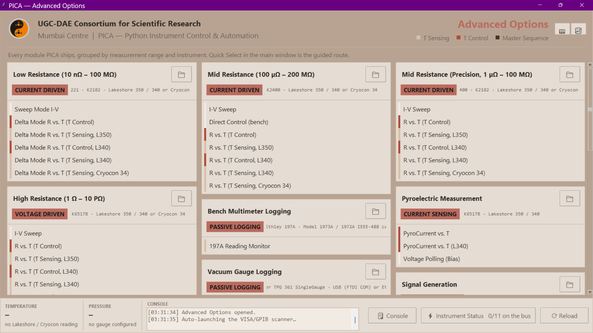
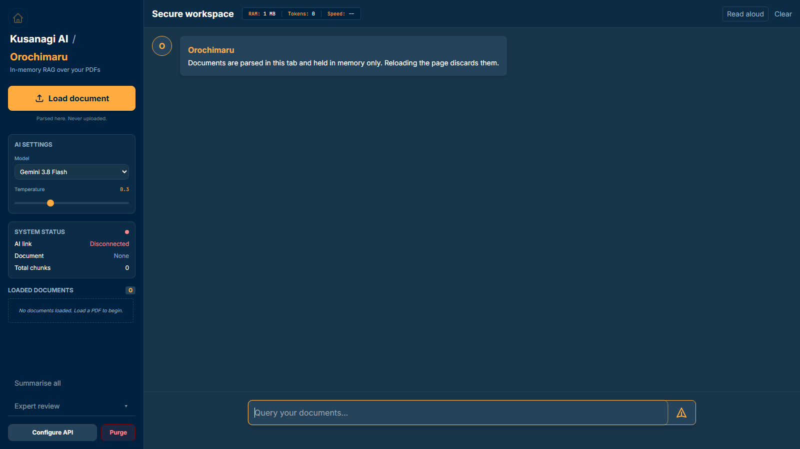

  <h1>Prathamesh Deshmukh</h1>

  

    Physics PhD scholar, <b>UGC-DAE CSR Mumbai</b> 
    Condensed matter experiments · lab automation · scientific software
  

  

    🌐 <a href="https://prathameshnium.github.io"><b>prathameshnium.github.io</b></a>
    &nbsp;·&nbsp;
    📁 <a href="#"><b>GitHub Portfolio</b></a> <!-- TODO: add portfolio page link -->
  

  
  
  
  
  
  
  
  
  

---

I build the tools around my experiments: cryogenic sample holders, instrument control software, and the analysis code that turns raw sweeps into results.

- **Open to:** postdoc positions in condensed matter or computational physics
- **Contact:** `prathameshnium[at]duck[.]com`

  
  
  
  
  
  
  
  

---

### Projects

<table width="100%">
  <tr>
    <td width="65%" valign="top">
      <h4>
        
        <a href="https://pica-python-instrument-control-and-automation.readthedocs.io/en/latest/">PICA</a> — Python Instrument Control & Automation
      </h4>
      
Automates transport and dielectric measurements, from acquisition to analysis. Submitted to JOSS.

      
      
      
    </td>
    <td width="35%" align="center">
      
    </td>
  </tr>
  <tr>
    <td width="65%" valign="top">
      <h4>
        
        <a href="https://prathameshnium.github.io/Kusanagi-AI/">Kusanagi-AI</a> — local AI tools for research
      </h4>
      
Desktop apps on Ollama or browser apps with your own key. Includes <i>Orochimaru</i>, a RAG assistant for reading papers; PDFs stay on your machine.

    </td>
    <td width="35%" align="center">
      
    </td>
  </tr>
  <tr>
    <td colspan="2" valign="top">
      <h4><a href="https://prathameshnium.github.io/ITMS-Hardware/">ITMS</a> — Integrated Transport Measurement System</h4>
      
Open hardware cryogenic platform for high-impedance transport, pyroelectric and magnetodielectric measurements in PPMS (14 T) and LN₂.

    </td>
  </tr>
</table>

| Also | |
| :--- | :--- |
| [Physics-Simulation-Toolkit](https://github.com/prathameshnium/Physics-Simulation-Toolkit) | Ising model, magnetic ordering, dielectric relaxation |
| [Solid-State-Calculators](https://github.com/prathameshnium/Solid-State-Physics-Calculators) | Arrhenius, Mott-VRH, activation energy |
| [Python-for-OriginPro](https://github.com/prathameshnium/Python-for-OriginPro) | Scripted plotting in OriginLab |
| [TupperTransformer](https://github.com/prathameshnium/TupperTransformer) | Bitmap editor for Tupper's self-referential formula |

---

  
    
  

